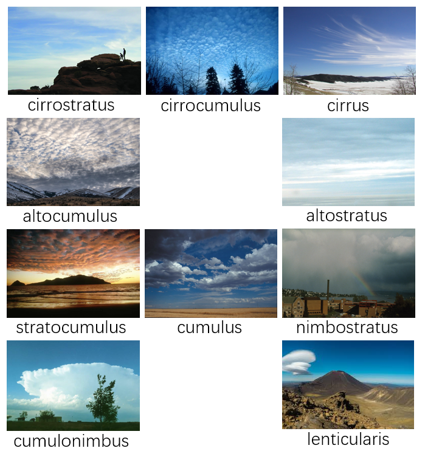

# Computing-Project-90055
This is the master research project of COMP90005. The type of this project is Software Development Project.
Handbook Entry: https://handbook.unimelb.edu.au/2019/subjects/comp90055

## Project Title : Cloud classification through Deep Learning
In this project, we will identificate ten types of clound througn deep learning methods, and implement a web to demonstrate prediction result.   
The cloud typs as follow:  
- cirrocumulus
- cirrostratus
- cirrus cloud
- cumulonimbus
- altocumulus
- altostratus
- cumulus
- nimbostratus
- stratocumulus
- lenticularis

<p align="center">
  
</p>

## Project Structure
There are three parts in the project:

1. DataSet Related Files  
  - 'Image_Collection' folder contains the scripts used in this project to create dataset

    [Notes] These scripts are separated and each of them is used to solve one single task.

  - 'Image_Processing' folder contains the scripts used in this project to pre-processing the dataset.

    [Notes] The original dataset is too large to upload to Github.
    
  - 'Generate_Data' folder contains the scripts used in this project to generate TFRecords that serve as input data for TensorFlow training models.
   
2. Object Detection Related Files
  - 'Object_Detection' folder contains the final model used in this project.

3. Web Related Files
  - 'Website' folder stores contains the final demonstration web application which deployed on the Google Cloud.  

## Project Steps  
1. Install TensorFlow GPU or CPU version and the releated package, sucha CUDA.
2. Install TensorFlow Object Detection API.  
Link: https://github.com/tensorflow/models/blob/master/research/object_detection/g3doc/installation.md  
3. Creating pictures and label it throught LabelImg. Link https://github.com/tzutalin/labelImg
4. Generate training data(TFRecord file)
5. Training and evaluation
6. Optimization and export Model
7. Create and deploy website

## Possible Issues  
I have met the following problems in the project, you might experience these as well.  

### No module name ‘object_detection‘
Under research directory, use the following command:  
On Windows System: set PYTHONPATH=%cd%;%cd%\slim  
On Linusx System: export PYTHONPATH=$PYTHONPATH:pwd:pwd/slim  

### Only 10 images in the test fold are visualized on Tensorboard  
Find the model's configuration file, in the eval_config{ } setting, add the following command  
num_visualizations: XX  (XX means show the number of XX prediction images in test directory)  
visualization_export_dir: "XX" (Output the prediction images to XX directory)  
For example:
```
eval_config{
  num_visualizations: 50
  visualization_export_dir: "eval"
}
```
### No variables to save error using tensorflow object detection API
This error happens when you choose the model releated Mobilenet_v1_FPN.  
You need add `from_detection_checkpoint: true` under train_config{}  
For example:  
```
train_config:{
  from_detection_checkpoint: true
}
```
### pascal_voc_detection_metrics problems
If you want to use IoU as the evaluation metric, you need to add `metrics_set: "pascal_voc_detection_metrics"` in the eval_config{ } setting.  
For example:  
```
eval_config: {
  metrics_set: "pascal_voc_detection_metrics"
}
```
### Show multiple lines in TensorBoard
If you want to show loss value of different models, or the training loss and evaluation loss in one image.  
Use the following command, could be more than two curve.
```bash
tensorboard logdir=curveName1:"path1",curveName2:"path2" --port=6006
```

### To Be Continue...


